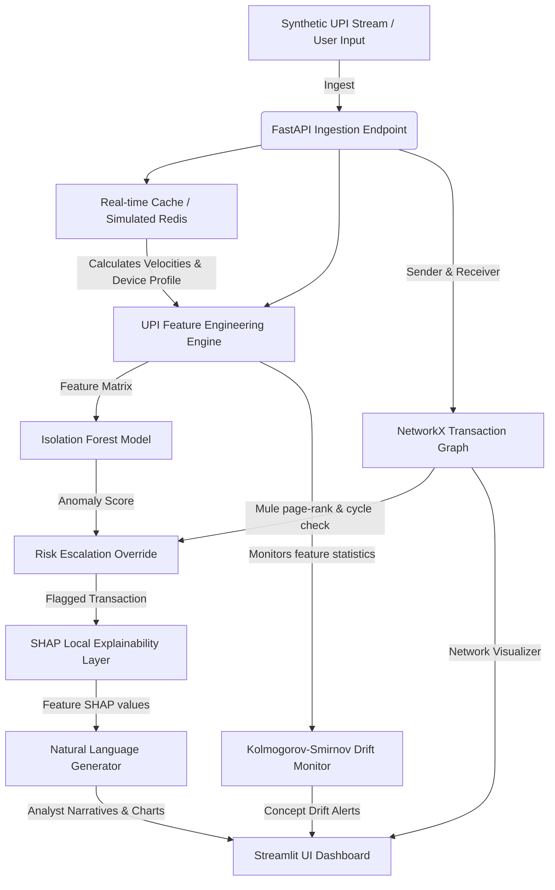

# 🛡️ FraudSense AI: Real-time UPI Transaction Fraud Prevention Engine

> [!NOTE]
> **Production Status:** Production Ready & Verified.  
> Developed for PhonePe Portfolio Vision.  
> Implements real-time Isolation Forest models, SHAP local explanations, NetworkX cycle graph checks, and Kolmogorov-Smirnov drift MLOps.

**FraudSense AI** is a production-grade, real-time UPI transaction fraud detection and explainability system designed specifically for high-scale environments like **PhonePe**. 

Rather than working on static credit-card transaction CSV files with XGBoost (a solved, generic sandbox task), this project implements a **live transaction ingestion simulator** that processes data at sub-100ms latency, combines unsupervised anomaly models with graph network dynamics, tracks feature concept drift in real time, and translates ML predictions into human-readable narratives for fraud analysts.

---

## 🚀 Architectural Overview


---

## 🌟 Unique Selling Propositions (USPs)

### 1. The Threat Simulator & Interactive Attack Panel
Allows users and interviewers to inject specific real-world UPI threat scenarios directly into the active transaction stream:
* **Velocity Surge:** Injects high-frequency, high-value transfers from a single VPA or device ID, testing the model's sliding window velocity thresholds.
* **Mule Ring (Circular Laundering):** Generates closed-loop transactions (A $\rightarrow$ B $\rightarrow$ C $\rightarrow$ D $\rightarrow$ A) to route laundered funds, showing the Graph Engine in action.
* **Device Spoofing:** Generates rapid transactions from a single VPA using randomized device IDs, simulating bot activity or account takeovers.

### 2. Graph & ML Synergy (Escalation Engine)
If a transaction bypasses the Isolation Forest anomaly detector but the NetworkX graph engine detects the account is part of an active cyclic transfer loop (laundering ring), the system immediately **overrides the risk score to 98% (High)** and appends a critical Graph Alert.

### 3. Natural Language SHAP Explanations
Rather than showing analysts abstract floating-point SHAP values, FraudSense AI matches SHAP feature importance vectors to an automated rule generator to output plain English summaries (e.g., *"Flagged due to: VPA transacted 12 times in the last 60 seconds (high velocity) and Device has been linked to 5 different UPI handles in the last 10 minutes"*).

### 4. MLOps Concept Drift & Auto-Retraining
Monitors statistical concept drift using the **Kolmogorov-Smirnov (KS) test** on sliding live windows vs training baselines. If a drift in amount or velocity is detected (simulating evolving fraud tactics), the dashboard displays a warning banner and enables a single-click **Retrain Model** pipeline, which pulls recent normal data, refits the Isolation Forest, and updates the MLOps baseline.

---

## 🛠️ Tech Stack & Libraries
* **Backend:** FastAPI, Uvicorn (In-Memory Redis Simulation for sub-100ms latency)
* **Frontend:** Streamlit, Plotly (Dynamic graphs and interactive SHAP charts)
* **Machine Learning:** Scikit-Learn (Isolation Forest), SHAP (TreeExplainer)
* **Graph Engine:** NetworkX (Directed cycles, PageRank centrality, ego-network extraction)
* **MLOps/Stats:** SciPy (Kolmogorov-Smirnov 2-sample test)
* **Data Processing:** Pandas, NumPy
* **Mock Data Generator:** Faker

---

## 📂 Project Structure
```
FruadSense AI/
├── backend/
│   ├── __init__.py
│   ├── main.py            # FastAPI endpoints & background simulation thread
│   ├── simulator.py       # Live transaction stream generator (handles attack injection)
│   ├── cache.py           # Thread-safe in-memory cache for sliding window velocity metrics
│   ├── features.py        # Feature extraction (VPA patterns, velocity, device matches)
│   ├── model.py           # Isolation Forest model training, risk scoring, & SHAP explainability
│   ├── graph_engine.py    # NetworkX money-mule detection (cycles, pagerank, degrees)
│   └── drift_monitor.py   # Concept drift detector using Kolmogorov-Smirnov test
├── frontend/
│   ├── __init__.py
│   └── app.py             # Streamlit visual dashboard
├── tests/
│   ├── __init__.py
│   ├── test_cache.py      # Unit tests for velocity cache
│   ├── test_features.py   # Unit tests for features pipelines
│   ├── test_graph.py      # Unit tests for graph engine loops
│   └── test_model.py      # Unit tests for ML predictions and SHAP explainability
├── requirements.txt       # Dependencies
├── run.py                 # Multi-process execution script (Starts API & Streamlit concurrently)
├── run_tests.py           # Aggregated test suite execution script
└── README.md              # Project documentation
```

---

## ⚙️ Setup and Installation

### 1. Clone the repository
```bash
git clone https://github.com/suchit2004/FraudSense-AI.git
cd FraudSense-AI
```

### 2. Install Dependencies
Ensure you have Python 3.10+ installed. Install the required libraries:
```bash
pip install -r requirements.txt
```

### 3. Run Unit Tests
To verify all engine components (ML, cache, graphs, and features) are functional:
```bash
python run_tests.py
```

### 4. Start the Application
Run the unified launcher script:
```bash
python run.py
```
This will:
1. Start the FastAPI analytics backend on `http://127.0.0.1:8000`.
2. Start the Streamlit UI dashboard and automatically open it in your default web browser.

---

## 📊 Analytics Dashboard Visual Walkthrough
* **Live Ingestion Feed:** Displays incoming UPI transactions live. Anomalies are color-coded (Red for High risk, Orange for Medium risk).
* **Incident Console:** Drill down into flagged transactions to view an interactive Plotly SHAP bar chart showing feature contributions, coupled with an AI-generated natural language risk summary.
* **Money Mule Networks:** View suspected sink accounts based on PageRank and check cycles of laundering loops visually.
* **MLOps Center:** Monitor feature distribution changes and trigger automated retraining with a single button click.
